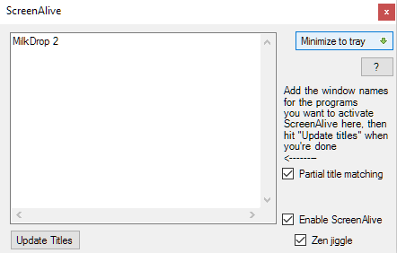

ScreenAlive
============

ScreenAlive is a very simple piece of software whose sole function is to "fake" mouse input to
Windows, and jiggle the mouse pointer back and forth when certain applications are open. This
prevents the screen from dimming and prevents the screensaver from showing.

Useful for avoiding screensavers or other things triggered by idle detection that, for whatever
reason, you can't turn off any other way; or as a quick way to stop a screensaver activating 
during an installation or when monitoring a long operation without actually having to muck about 
with the screensaver settings. Personally, I use it for multimedia programs that don't correctly
tell Windows to disable idle detection.

By default, ScreenAlive will poll Windows every 50 seconds to check if the programs that you
have chosen are open and move the virtual mouse if they are, and do nothing if they are not. 
Since the smallest screen timeout in Windows is 60 seconds, this should always work and it is
currently not a configurable setting, although I may add this functionality in the future.

User Interface:

Operation
=========

Simply run the ScreenAlive.exe included in the Releases section of this repo. Enter the titles1 
(or parital titles if "Partial title matching" is checked) of windows that you want ScreenAlive 
to activate for. This means that any time a window is opened with that title, ScreenAlive will 
keep the screen from timing out (activating the screensaver or dimming to black). Note that if 
"Enable ScreenAlive" is unchecked, this program will do nothing. You can minimize ScreenAlive 
to the system tray to keep it from impeding your normal workflow and cluttering the taskbar.

"Zen Jiggle": This activates Zen Jiggle mode. The way that ScreenAlive works is that it causes
your pointer to move around to keep Windows from thinking that the current user is idle. In Zen
Jiggle mode, this is done *virtually* - that is, your mouse will not actually move, but Windows
will think it is moving, so it will work the same. In Zen Jiggle mode, you can still use your
computer as normal and will not notice any difference in the way the mouse cursor moves since
it is only jiggling a *virtual* mouse. If you disable this mode, your mouse cursor will jiggle
periodically, meaning that it will be difficult to use your computer when this program is
running. Therefore, Zen Jiggle should only be disabled if it isn't working for whatever reason.
In other words, ignore this setting unless the program isn't working.

To minimize ScreenAlive to the system tray, click the button marked with a green, down-pointing 
arrow.

1 titles cannot contain the following "magic string" used as a delimiter: "<||;||;||>"
Of course, this also leads to obvious code-injection and input sanitization concerns, but this
program is not meant to be secure and I'm not ever planning on making it invulnerable due to
my extremely low perceived benefit.

Command line options
=======

If you want to start the ScreenAlive with jiggling already enabled, run the ScreenAlive.exe 
with either the `-j` or `--jiggle` command-line switch.

The `-z` or `--zen` flag forces zen jiggling to be enabled for the current (and future) 
invocations of ScreenAlive.

The `-m` or `--minimized` flag tells ScreenAlive to start already minimized.

The `-p` or `--partial_matching` flag tells ScreenAlive to check for partial title matches.

Note that any time you change a setting or use a flag to launch the program, those settings
will be saved for all future instances of ScreenAlive in the Windows registry at 
"HKCU/SOFTWARE/Cutright Industries/ScreenAlive".

That's it. Enjoy!

Getting ScreenAlive to run on startup in Windows
=======

1. Make a new file in the same directory as ScreenAlive.exe
2. Open the file in notepad (or whatever text editor you use), and type the following:
>   start "" "ScreenAlive.exe" -m  
>   exit  

The `-m` flag makes it start minimized to tray, which is useful since it's meant to be used as a
background program.
3. Save the file as "script.bat" (make sure the file ending is .bat, not .txt)
4. Type "run" into the start menu
5. Type "shell:startup"
6. Make a shortcut to your batch file and place it here
That's it!

Support
=======

ScreenAlive is a free product provided without warranty or support. However, I may update this
program at any time if I feel there is a need to (if it stops working due to a change in
Windows) or if I decide to add features or streamline the interface.
